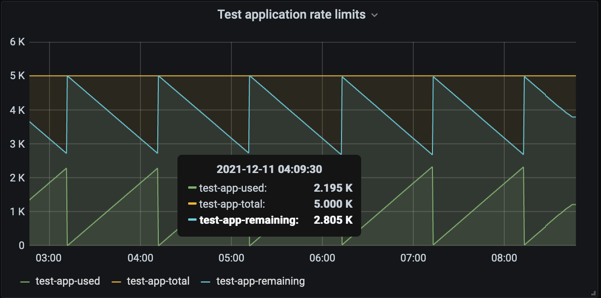

[](https://sonarcloud.io/summary/new_code?id=kalgurn_github-rate-limits-prometheus-exporter)
[](https://sonarcloud.io/summary/new_code?id=kalgurn_github-rate-limits-prometheus-exporter)
[](https://sonarcloud.io/summary/new_code?id=kalgurn_github-rate-limits-prometheus-exporter)
[](https://artifacthub.io/packages/search?repo=github-rate-limit-prometheus-exporter)
# Github Rate Limit Prometheus Exporter

A [prometheus](https://prometheus.io/) exporter which scrapes GitHub API for the rate limits used by PAT/GitHub App.

Helm Chart with values and deployment can be found [here](./helm/github-rate-limits-prometheus-exporter)

For the exporter to run you need to supply either a GitHub Token or a set of a GitHub App credentials, alongside with a type of authentication to use(pat/app)

### The metrics can then be represented on a [grafana](https://grafana.com) dashboard





## Docker

PAT
```sh
docker run -d \
    -e GITHUB_AUTH_TYPE=PAT \
    -e GITHUB_TOKEN=my_token \
    -p 2112:2112 \
    ghcr.io/kalgurn/grl-exporter:latest
```

GitHub APP
```
docker run -d \
    -e GITHUB_AUTH_TYPE=APP \
    -e GITHUB_APP_ID=my_app_id \
    -e GITHUB_INSTALLATION_ID=my_app_installation_id \
    -e GITHUB_APP_NAME=name_of_my_app
    -e GITHUB_PRIVATE_KEY_PATH=/tmp
    -v $PWD/path_to/key.pem:/tmp/key.pem
    -p 2112:2112 \
    ghcr.io/kalgurn/grl-exporter:latest
```